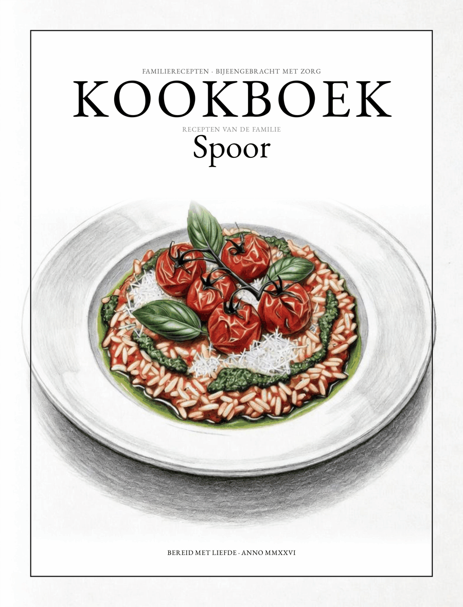

# Kookboek — Familie Spoor



This isn't a book written for a wide audience. It's the recipes one family has
actually cooked over the years, gathered here for the first time so they don't
only live in one person's head. Nothing in it was invented from scratch —
every recipe started somewhere else and slowly turned into "how we make it."
Quantities are approximate, and a cookbook like this is never really finished.

The book itself is written in Dutch, since it's really just for family.

## Browse it online

[spoorcc.github.io/kookboek](https://spoorcc.github.io/kookboek/) — search the
recipes and read any of them right in the browser.

## Get a printed copy

The book is printed on demand via [Lulu.com](https://www.lulu.com). To order one:

1. Go to [lulu.com/create](https://www.lulu.com/create) and start a new print book.
2. Pick **Hardcover Casewrap** binding. The interior text block is typeset at
   **189 × 246 mm (7.44 × 9.68 in, Crown Quarto)** — `KookboekFamilieSpoor.pdf`.
   The case itself is physically larger (**443.05 × 290.32 mm** wrapped sheet,
   for a 223-page block) since a hardcover case wraps around the block with a
   small overhang — that's `KookboekFamilieSpoor-cover.pdf`. The two files are
   sized independently on purpose; they aren't meant to match.
3. Upload both files.
4. Hardcover casewrap spine width isn't a fixed formula — Lulu computes it from
   your interior's page count once uploaded. If the generated cover template's
   spine width doesn't match `KookboekFamilieSpoor-cover.pdf`, rebuild the cover
   (see `cover/cover.tex`'s header comment) with the page count and spine width
   Lulu reports, before ordering a proof.

## Build it locally

Requires XeLaTeX. Run:

```sh
./build.sh
```

This produces `KookboekFamilieSpoor.pdf` and `KookboekFamilieSpoor-cover.pdf`.

## License

The book itself — recipes, prose, and illustrations — is licensed under
[CC BY-SA 4.0](https://creativecommons.org/licenses/by-sa/4.0/) (see
[LICENSE](LICENSE)): copy it, adapt it, print your own family's version, just
credit Familie Spoor and share it under the same license.

The code that builds it is licensed separately under [MIT](LICENSE-MIT) —
Creative Commons licenses aren't meant for software.
